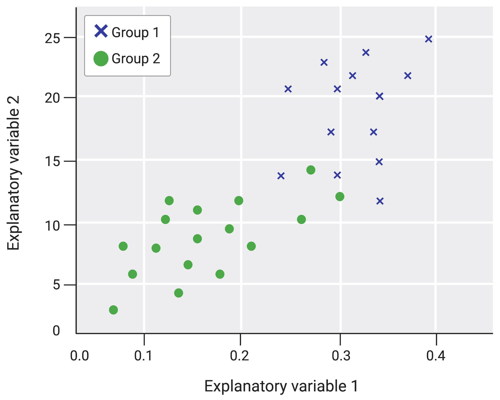
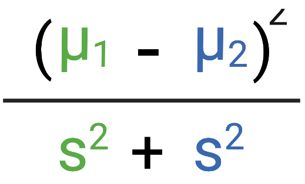
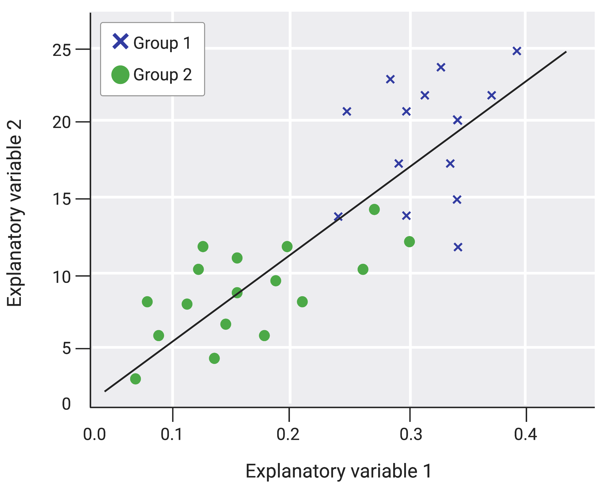
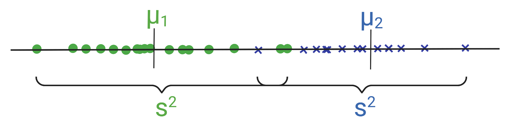
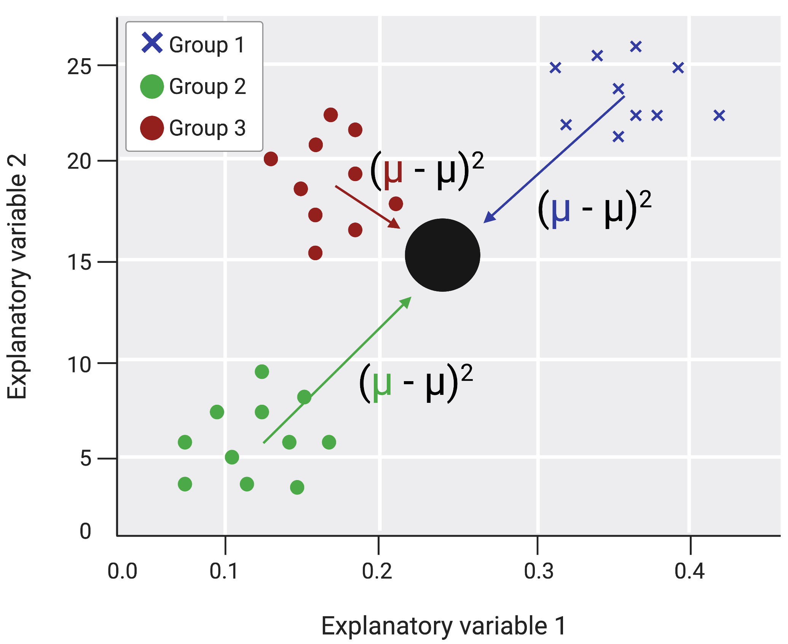
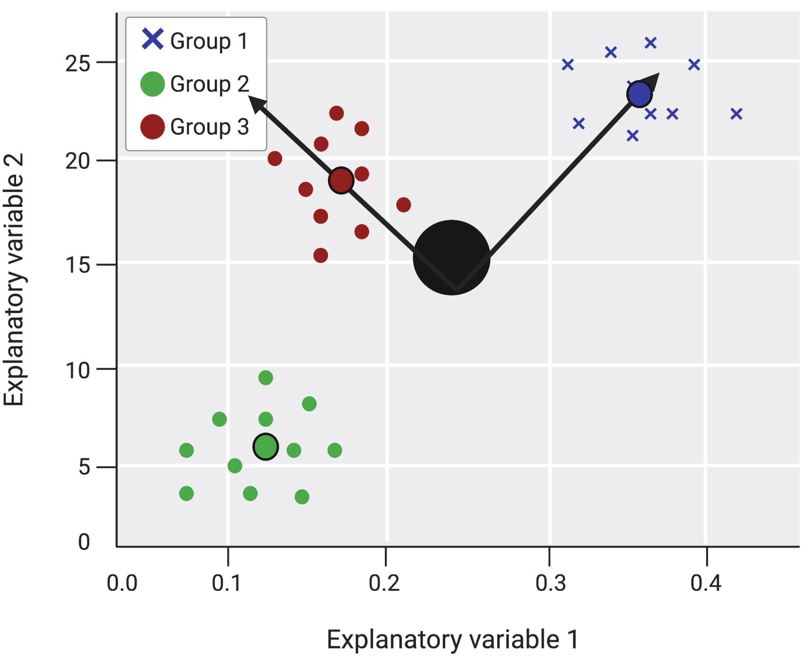
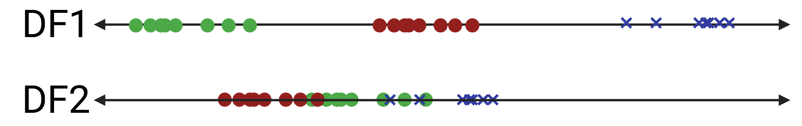
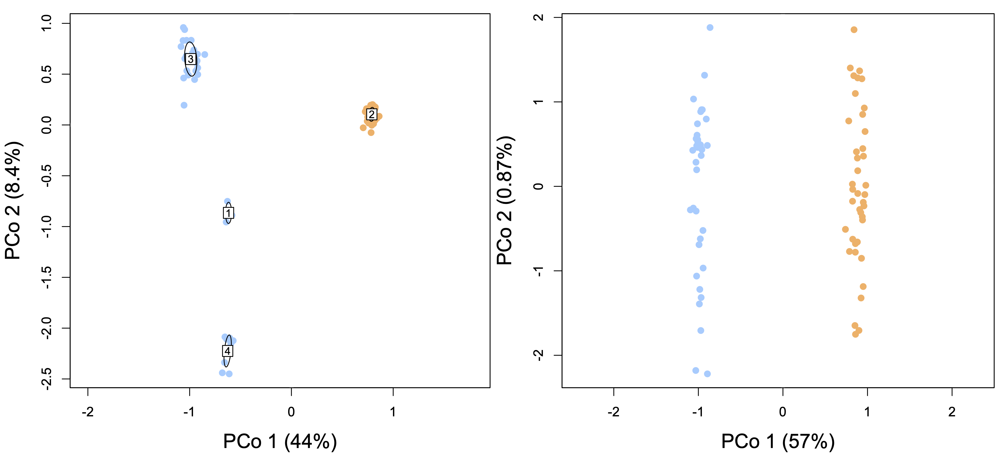

```{r setup}
#library(custompackage)
```

```{r}
knitr::opts_chunk$set(fig.path = "images/")
```

# Objectives

 The objective of this module is to describe how to use linear discriminant function analysis and provide functions to easily run LDAs and visualize output.
 
# Preliminaries

 This module requires the following packages: {tidyverse}, {dplyr}, {cowplot}, {patchwork}, {energy}, {MASS}, {Hmisc}, and {caret} in addition to our package ({custompackage}). NOTE TO SELF: let's name this something more fun?
 
# Linear discriminant function analysis

Linear discriminant function analysis (LDA) is the most common form of discriminant function analysis (DFA), which is a dimensional reduction technique. LDA finds linear combinations of continuous variables to best distinguish samples that belong to different groups. In other words, you use this analysis to figure out whether you can predict group membership from a set of continuous variables.

Let's take a toy example to illustrate how LDA works. Below, we plot two explanatory variable for samples that belong to either of two groups.

```{r echo=FALSE, out.width="100%"}

```

We can see that samples in group 1 have relatively high values of explanatory variables 1 and 2, while group 2 samples have relatively low values of these variables. Intuitively, we can imagine that just knowing the values of explanatory variable 1 and 2 for a sample might allow us to accurately predict what group it belongs to. 

When we run an LDA on this sort of dataset, we create a function that consists of the explanatory variables weighted such that we best separate between-group means, while minimizing within-group variance. Mathematically, this is as follows:

```{r echo=FALSE, out.width="25%"}

```

where mu is the mean for each group (blue = group 1, green = group 2) and s squared is the variance within each group (or scatter as it is often referred to in DFA literature). The function tries to maximize this ratio.

The resulting discriminant function (DF) can be visualized as a line on this graph.

```{r echo=FALSE, out.width="100%"}

```

If we squish down all the points onto that line and plot it horizontally, we can see where the values for mu and s come from.

```{r echo=FALSE, out.width="100%"}

```

In this case, there is pretty good separation between the groups!

If you have more than two groups, the DF generating process is a little bit different. In fact, if you have more than 2 groups, you will need more than 1 discriminant function. The number of DFs generated from the analysis will be 1 fewer than the number of groups you have. Below, we show another toy plot with three groups, which appear to be separable based on their values of explanatory variables 1 and 2. 

```{r echo=FALSE, out.width="100%"}

```

Instead of defining distance between groups as the difference between the means, we attempt to maximize the distance of the groups means to a central point (big black dot), while minimizing variance within each group. To accurately describe the distance of groups from each other (and the center point), we need two perpendicular axes (rather than a single line). This is because three points (the three mean values) define a plane, which must be described along two axes. In the last example, we only had two points (mean values) and since two points define a line, we needed only one axis to distinguish groups.

```{r echo=FALSE, out.width="100%"}

```

We can again squish down the points to each line and visualize those. The combination of weighted explanatory variables that define each line are our discriminant functions. Whichever line captures the most variance between groups will be defined as the first DF.

```{r echo=FALSE, out.width="100%"}

```

Linear discriminant function assumes a few things about any given dataset. 

1. Each sample belongs to only one group.
2. Each observation is independent.
3. Each group is homoscedastic (has equal variances for all explanatory variables across groups).
4. All independent variables are multivariate normal (normally distributed when all other variables are held constant).

Because this method relies on group means and variances, it is very sensitive to heteroscedasticity and non-normality. In addition to these assumptions, the sample size must be at least the number of independent variables + 2 and the number of samples across groups should be similar. If your data fails any of these assumptions or requirements, there are other types of discriminant function analysis that might be more appropriate.

# Examples

We will now walk through two examples. The first dataset has two natural grouping, while the second dataset has three. In the first example, we process the data, run the LDA, and visualize the results by hand to illustrate each step. In the second example, we use the functions we created to expedite analysis and visualization.

## Using larval fish swimming behavior to predict familial (genetic) identity.

Highly fecund fish often experience the highest levels of mortality during larval development, mainly from predation and starvation. In red drum fish, larvae exhibit stable differences in survival related behaviors. Understanding what underlies these stable differences will allow us to better understand the composition of adult fish communities as well as improve fisheries management practices.

In this dataset, we scored routine swimming behaviors of 76 larval red drum. These behaviors correlate with foraging ability. These fish came from one of two source tanks that contained different adult individuals. Thus, individuals from separate tanks are fully unrelated while individuals from the same tank could be partial or full siblings. We used genotyping to identify that all larvae from each tank had a single mother. Tank 1 had a single mother-father pair sire all offspring, while multiple fathers sired the larvae in tank 2. This can be visualized below. 

```{r echo=FALSE, out.width="100%"}

```

The lefthand plot is a principal coordinates plot when all genes are considered. Groups were identified using K-means clustering. The right plot shows just mitochondrial transcripts and thus indicates maternal identity. Thus, our individuals fall into 2 maternal groups and four family groups. We will only look at predicting maternal grouping because the sample sizes within each familial group (1-4) differ greatly, which prevents us from being able to use LDA. The above image is from Smith et al. (In review).

Below, we try and see whether larvae's familial identity can be distinguished by their routine swimming behavior.

### data exploration and assumption checking

```{r}
library(tidyverse)
library(dplyr)

f <- "data/reddrum_data.csv"
rd_data <- read_csv(f,col_names = TRUE)

head(rd_data)
str(rd_data)
rd_data <- rd_data %>% mutate("Mother" = as.factor(Mother))
str(rd_data)
```

When we look at the data, we see a column for individual id (ID), genetic grouping ("Mother"), and five routine swimming measurements. If we look at the structure of the data, we see that the Mother variable is currently numeric, so I transform it into factor levels.

Next, we look at the routine swimming behavior variables to see if they follow assumptions required to run an LDA.
```{r}
library(ggplot2)
library(cowplot)
library(Hmisc)
# do the groups have similar sample sizes?
table(rd_data$Mother) #  yes!

# raw data boxplots by group
p1 <- ggplot(data=rd_data,aes(x=Mother,y=RDistanceMoved_cm)) + geom_boxplot() + 
  xlab("Mother") + ylab("Distance moved during routine swimming (cm)")
p2 <- ggplot(data=rd_data,aes(x=as.factor(Mother),y=RMeanSpeed)) + geom_boxplot() + 
  xlab("Mother") + ylab("Mean speed during routine swimming")
p3 <- ggplot(data=rd_data,aes(x=as.factor(Mother),y=RMeanAngularSpd)) + geom_boxplot() + 
  xlab("Mother") + ylab("Mean angular speed during routine swimming")
p4 <- ggplot(data=rd_data,aes(x=as.factor(Mother),y=RMeanMeander)) + geom_boxplot() + 
  xlab("Mother") + ylab("Mean meandering during routine swimming")
p5 <- ggplot(data=rd_data,aes(x=as.factor(Mother),y=RMeanMobility)) + geom_boxplot() + 
  xlab("Mother") + ylab("Mean mobility during routine swimming")
plot_grid(p1,p2,p3,p4,p5)

# log transformed boxplots by group
g1 <- ggplot(data=rd_data,aes(x=Mother,y=log(RDistanceMoved_cm))) + geom_boxplot() + 
  xlab("Mother") + ylab("log(Distance moved during routine swimming (cm))")
g2 <- ggplot(data=rd_data,aes(x=Mother,y=log(RMeanSpeed))) + geom_boxplot() + 
  xlab("Mother") + ylab("log(Mean speed during routine swimming)")
g3 <- ggplot(data=rd_data,aes(x=Mother,y=log(abs(RMeanAngularSpd)))) + geom_boxplot()  + 
  xlab("Mother") + ylab("log(Mean angular speed during routine swimming)")
g4 <- ggplot(data=rd_data,aes(x=Mother,y=log(abs(RMeanMeander)))) + geom_boxplot() + 
  xlab("Mother") + ylab("log(Mean meandering during routine swimming)")
g5 <- ggplot(data=rd_data,aes(x=Mother,y=log(RMeanMobility))) + geom_boxplot()  + 
  xlab("Mother") + ylab("log(Mean mobility during routine swimming)")
plot_grid(g1,g2,g3,g4,g5)

# log transformed data
logtrans_traits <- rd_data %>% mutate("logSpeed" = log(RMeanSpeed), "logDist" = log(RDistanceMoved_cm), "logMobility" = log(RMeanMobility),"logAngSpd" = log(abs(RMeanAngularSpd)),"logMeander" = log(abs(RMeanMeander))) %>% dplyr::select(ID,Mother,logSpeed,logDist,logMobility,logAngSpd,logMeander)
```

Looking at the raw data, it is clear that variances are not equal among groups across the five behavioral variables. Group 2 has more variance generally. We can fix this by transforming our data. I plotted a log transformed version of these variables above and made new log transformed versions of each behavioral measure.

We also need to check for multicollinearity in our dataset.

```{r}
# are there multicollinearities in the data?
corDF <- as.matrix(logtrans_traits[,3:7])
rcorr(corDF) # yes

# remove the highly multicollinear variables
logtrans_traits <- logtrans_traits %>% dplyr::select(ID,Mother,logSpeed,logMobility,logAngSpd)
```

We can see that there are a lot of correlations among the 5 variables. The worst of these are the Speed and Distance variables, which are almost perfectly correlated. The meandering variable is also highly correlated with the other variables. We removed Meandering and Distance and keep the other three variables (Speed, Mobility, Angular Speed).

We next split the data into a training set and testing set. The training set is used to generate the linear discriminant function that is then applied to the testing set to predict group membership. We assess the power of the LD to discriminant individuals by comparing actual group membership to predicted membership. LDA could be done and tested on the full dataset, but this will likely overstate its ability to discriminant groups.

Prior to running the LDA, we also center and scale the data since our variables are measured using different units.

```{r}
library(caret)
# random number generator
set.seed(60)
# which samples to put into the training dataset
training.samples <- logtrans_traits$Mother %>% createDataPartition(p = 0.8, list = FALSE)
# training dataset
train.data <- logtrans_traits[training.samples,]
# testing dataset
test.data <- logtrans_traits[-training.samples,]
# normalize the data
preproc.param <- train.data %>% preProcess(method = c("center","scale"))
# transform using estimated parameters
train.transf <- preproc.param %>% predict(train.data)
test.transf <- preproc.param %>% predict(test.data)
```

Now, we run an LDA on the training dataset (MASS::lda) and use the resulting function to predict the groupings for the testing data (MASS::predict).

```{r}
library(MASS)
# run the LDA on the training set
model <- lda(Mother ~ logSpeed + logMobility + logAngSpd, data=train.transf)
# predict group identity of test set
pred_test <- model %>% predict(test.transf)
# print model output
model
# Predicted classes
pred_test$class
# Predicted probabilities of class membership.
round(pred_test$posterior,2)
# Linear discriminants
pred_test$x
```

The output of the model when you print it tells you the probability of group membership prior to knowing anything about the sample (what percentage of samples fall into each category in the training set), the group mean values for each explanatory variable, and the coefficients for the linear discriminant function that was generated. The explanatory variables with the largest absolute values best distinguish groups in the  training set. In this case, log(Mobility) and log(speed) are most useful in discriminating among groups.

The output of the prediction call give you the predicted grouping assignments for each sample in the test dataset, the probabilities of falling into either category for each sample, and the LD scores for each sample. The LD score is the value you get when you plug in the sample's values for each explanatory variable into the linear discriminant function. These numbers should be very similar for individuals in the same group and very different for individuals in different groups.

Below, we visualize by hand how well the groups are distinguished by the linear discriminant function.

```{r}
lda.data <- cbind(train.transf,predict(model)$x)
ggplot(data=lda.data, aes(x = LD1))+
  geom_histogram(binwidth = 0.5, fill = "cyan", color = "black")+
  facet_wrap(~ Mother, nrow = 2 ,strip.position = "bottom")+
  theme_bw()

table(test.transf$Mother,pred_test$class)
mean(pred_test$class == test.transf$Mother)
```

Ideally, the samples would be very separated along LD1 according to group. We see however, quite a bit of overlap where many samples have intermediate LD values. When we compare the predicted groupings of the test data samples to the actual groups, we see that we classified 11 samples correctly (5 assigned to group 1 correctly and 6 assigned to group 2 correctly) and 4 samples incorrectly. This  gives us a 73% accuracy in our testing set. Thus, we do an okay job of classifying samples into maternal group just by their swimming behavior.

In the following example, we attempt to predict membership into 3 categories and employ the functions we created to streamline data processing for LDA and visualization of LDA output.

## Using stress response data to predict reproductive/social class for male swordtail fish